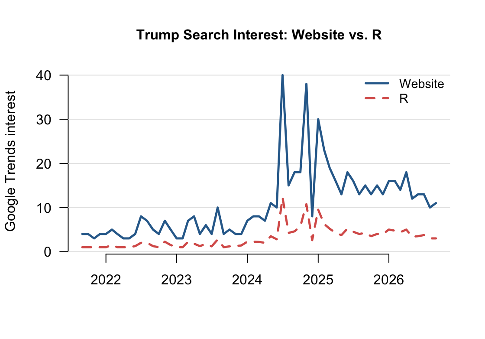

## Query Parameters

- **Search terms:** Trump, Kamala Harris, Election
- **Geography:** United States
- **Time window:** Past 5 years
- **Category:** All Categories
- **Search type:** Web Search
- **Date/time pulled:** September 13, 2026, 8:54 PM

**Additional current-news query:** iPhone Duo

- **Geography:** United States
- **Time window:** Past month
- **Category:** All Categories
- **Search type:** Web Search
- **Date/time pulled:** September 15, 2026, 11:03 AM

## What I Observed

**1. Time window changes interval**

Google Trends changes the temporal resolution depending on the time window.

- Past 5 years: monthly  
- Past year: weekly


**2. 0–100 is not raw search volume**

The unit is a normalized search-interest index from 0 to 100.

- 100 means peak relative interest.
- 0 does not necessarily mean literally zero searches.

**3. Changing the comparison set changes the values**

After removing "Election," the values for Trump and Kamala Harris changed substantially, showing that Google Trends values are relative to the query rather than fixed search counts.

## R Code

```{r}
#| eval: false

library(gtrendsR)

TrumpHarrisElection <- gtrends(
  c("Trump", "Harris", "election"),
  onlyInterest = TRUE,
  geo = "US",
  gprop = "web",
  time = "today+5-y",
  category = 0
)

the_df <- TrumpHarrisElection$interest_over_time
plot(TrumpHarrisElection)
```

## Website vs. R

- **Temporal resolution:**  
  The website returned monthly observations, while the R pull returned weekly observations. I aligned the two series at the monthly level before comparing them.

- **Difference in values:**  
  The two series were not identical. After alignment, the mean difference (R - Website) was -7.59 points, the median was -6, and the differences ranged from -27.75 to -2.

- **Direction of difference:**  
  In this comparison, the aggregated R values were consistently lower than the website values.

- **Interpretation:**  
  This does not necessarily mean that one method is wrong. The discrepancy may reflect differences in temporal resolution, sampling, rescaling, and pull timing.

{width=70%}

## Method Comparison

- **Reproducibility:**  
  R is more reproducible because the query parameters and data-processing steps are recorded in code. The website requires the user to manually record the search settings. However, reproducibility of the procedure does not guarantee that Google Trends will always return exactly the same values.

- **Provenance:**  
  In R, the search terms, geography, time window, category, and search type are documented directly in the code. For the website download, these settings need to be recorded separately.

- **Scale:**  
  R is more efficient for running many terms, countries, or repeated queries. The website is easier for a small number of searches, but becomes more time-consuming when the number of queries increases.

- **Fragility:**  
  The R method can fail because of rate limiting. During this assignment, I received a 429 "Too Many Requests" error after repeated requests. The website method is less convenient for automation and can also be affected by interface changes or manual errors.

- **Additional R output:**  
  The R object also included geographic breakdowns, related topics, and related queries that were not included in the website time-series CSV.

- **Harris vs. Kamala Harris:**  
  The results for "Harris" and "Kamala Harris" were very different. "Harris" is a broader and more ambiguous search term, while "Kamala Harris" more closely matches the intended concept. This shows that the choice of search term is part of the measurement process.

- **Repeated R pull:**  
  I ran the same R query twice a few minutes apart, and the values were identical in my test. However, Google Trends data are sampled and rescaled, so identical results in one test do not guarantee that future pulls will always be identical.